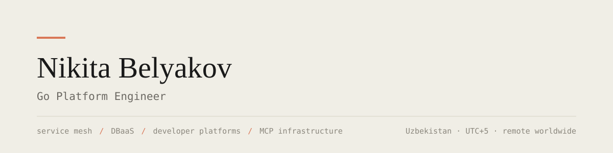

<picture>
  <source media="(prefers-color-scheme: dark)" srcset="assets/header-dark.svg">
  
</picture>

<br>

I build **internal developer platforms** — the layer that lets product teams ship
without each of them reinventing networking, databases and tooling.

Currently on the IDP platform team at **VK**: service mesh consolidation across
the holding, runtime traffic control, and the platform's MCP layer that puts
internal infrastructure behind AI coding agents.

```
Go · Kubernetes · Consul · PostgreSQL · ClickHouse · Redis · Kafka · gRPC · Temporal
```

<br>

## Work

<table>
<tr>
<td width="50%" valign="top">

**Service mesh & traffic control**

Consolidated the holding's separate mesh solutions into one platform offering —
a service onboards through a single action. Rate limiting, timeouts and circuit
breakers reconfigurable at runtime, without a redeploy.

</td>
<td width="50%" valign="top">

**DBaaS**

Cluster provisioning with full lifecycle management and an SDK that ships
metrics out of the box. `100+` clusters for product teams; provisioning went
from days to minutes.

</td>
</tr>
<tr>
<td width="50%" valign="top">

**AI / agent infrastructure**

An MCP Gateway aggregating per-domain MCP servers — stateless with Redis-backed
sessions, BM25 multilingual tool search, OAuth scope-based authorization, and
clients for Claude Code, Codex and OpenCode.

</td>
<td width="50%" valign="top">

**High-load product backends**

A `2M+ MAU` service in the VK Health ecosystem on a DDD architecture, with the
ClickHouse analytics pipeline behind it.

</td>
</tr>
</table>

<br>

## Projects

| | |
|---|---|
|**[porovnu](https://github.com/HexArchy/porovnu)**|Bill splitter running in production at [porovnu.hexarch.ru](https://porovnu.hexarch.ru). Event-driven Go microservices, SwiftUI client.|
|**[itmo-calendar](https://github.com/HexArchy/itmo-calendar)**|CalDAV service syncing university schedules into Apple Calendar, Google Calendar and anything else speaking CalDAV.|
|**[goimporter](https://github.com/HexArchy/goimporter)**|Universal Go import organizer — deterministic grouping and ordering across a codebase.|
|**[onec-conf-fetcher](https://github.com/HexArchy/onec-conf-fetcher)**|NetExec module for collecting 1C Enterprise configuration files over SMB.|

<br>

## Background

Information Security at **ITMO University**, 2021–2026. CTF competitor —
attack–defense, HackTheBox. It shows up less as a job title and more in how I
design authorization and platform boundaries.

I write about architecture at **[hexarch.ru](https://hexarch.ru)**.

<br>


<br>

## Contact

Open to remote work worldwide — Uzbekistan, UTC+5, no sponsorship needed.

[](mailto:nikitabelekov@gmail.com)
[](https://t.me/nikitabelekov)
[](https://hexarch.ru)
